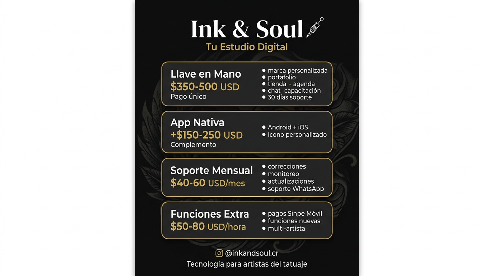

# Ink & Soul — Modelo de Precios

**Plataforma completa para estudios de tatuaje:** portafolio, tienda, agenda, chat con clientes, visualizador corporal, diseñador de tatuajes, cursos, panel de analíticas y administración del estudio.

> **Para compartir en Instagram:** usá la imagen `precios-instagram.png` en este mismo directorio.
>
> 

---

## Nivel 1 — "Llave en Mano" (Configuración Completa)

**Pago único: $350 - $500 USD** (₡180,000 - ₡260,000 aprox.)

Incluye:

- Proyecto Firebase dedicado + despliegue en Vercel
- Marca personalizada (nombre del estudio, logo, colores, bio, redes sociales)
- Carga inicial de contenido (portafolio, productos, horarios)
- Reglas de seguridad desplegadas
- PWA lista (instalable desde el navegador del celular)
- 1 sesión de capacitación (~1 hr) sobre el panel de administración
- 30 días de soporte post-entrega (solo corrección de errores)

---

## Nivel 2 — "App Nativa" (Complemento)

**Pago único: +$150 - $250 USD**

Incluye:

- Compilación del APK Android + asistencia para publicar en Google Play
- Compilación iOS TestFlight + guía para App Store
- Ícono de app y splash screen personalizados

---

## Nivel 3 — "Soporte Mensual" (Mantenimiento)

**$40 - $60 USD/mes** (₡20,000 - ₡30,000)

Incluye:

- Corrección de errores y ajustes menores (hasta 2 hrs/mes)
- Monitoreo de Firebase (alertas de uso)
- Actualización de dependencias (trimestral)
- Soporte prioritario por WhatsApp/Telegram

> Sin este contrato, la entrega es final: se configura, se capacita y se entrega.

---

## Nivel 4 — "Funciones Extra" (Desarrollo a Medida)

**$50 - $80 USD/hora**

Para cualquier cosa más allá de lo que la plataforma ya ofrece:

- Integración de pagos (Sinpe Móvil, Stripe)
- Lógica de notificaciones personalizada
- Páginas o funcionalidades nuevas
- Soporte multi-artista dentro de un mismo estudio

---

## ¿Qué obtiene el cliente?

| Funcionalidad | Descripción |
|---|---|
| Portafolio | Galería de trabajos con filtros por estilo |
| Tienda | Catálogo de productos con carrito de compras |
| Agenda | Sistema de citas con recordatorios |
| Chat | Mensajería en tiempo real con clientes + asistente FAQ |
| Diseñador | Herramienta de diseño en canvas para crear ideas |
| Visualizador corporal | Mapa SVG del cuerpo para ubicar tatuajes |
| Cursos | Listado y reservación de cursos/talleres |
| Panel de administración | Gestión completa del estudio desde `/studio` |
| Analíticas | Dashboard con métricas de citas, ventas y metas mensuales |
| App instalable (PWA) | Se instala como app desde el navegador, sin tienda |

---

## Cláusula Clave del Contrato

> Este acuerdo cubre la configuración inicial, personalización y entrega de la plataforma. El soporte post-entrega se limita a 30 días calendario únicamente para corrección de defectos. El mantenimiento continuo, actualizaciones, adición de funcionalidades y soporte técnico requieren un acuerdo de soporte mensual por separado (Nivel 3). El cliente asume la titularidad de todas las cuentas de infraestructura (Firebase, Vercel, dominio) y es responsable de los costos asociados.

---

## Proyección de Ingresos (Conservadora)

| Escenario | Ingreso Año 1 |
|---|---|
| 6 configuraciones @ $400 + 3 en mantenimiento @ $50/mes | **$4,200 USD** |
| 12 configuraciones @ $450 + 6 en mantenimiento @ $50/mes | **$9,000 USD** |
| 12 configuraciones + 4 apps nativas + 8 en mantenimiento | **$12,600+ USD** |

---

*Ink & Soul — Tecnología para artistas del tatuaje*
